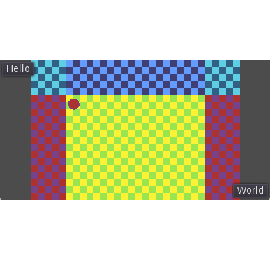

# BoundedScaleCamera

AaronWizard  
2018

Demonstrates scaling of the window without black bars and bounding the camera to the level's size.

## Scaling without black bars

  
  

When the window's size changes, the game view is scaled such that a defined minimum length fits along the window's shortest dimension while the view expands along the window's longest dimension

The minimum length is the minimum of the display width and height set in Project Settings.

## Bounded camera

  
  

The extended Camera2D may be assigned a world size. The camera's limits now depends on the size of the world relative to the size of the viewport. If the world is larger than the viewport along a dimension, the limits are set to the edges of the world. Otherwise the limits are set such that the world is centred in the window.